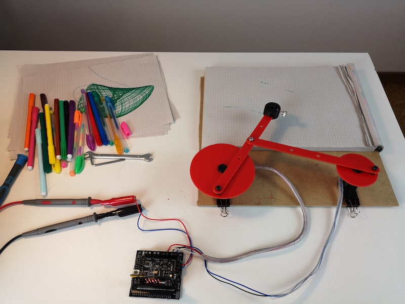
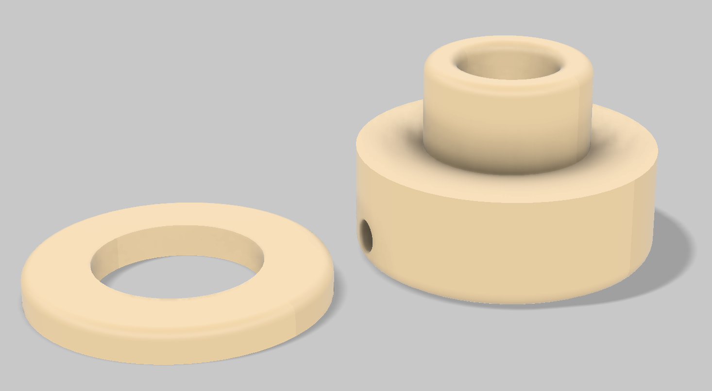
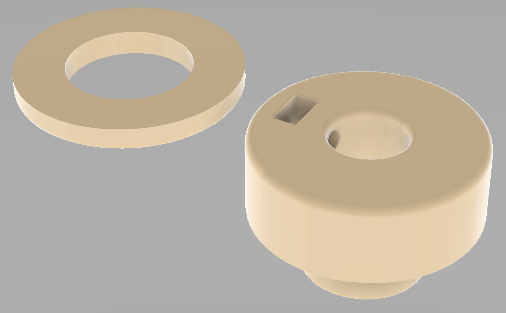
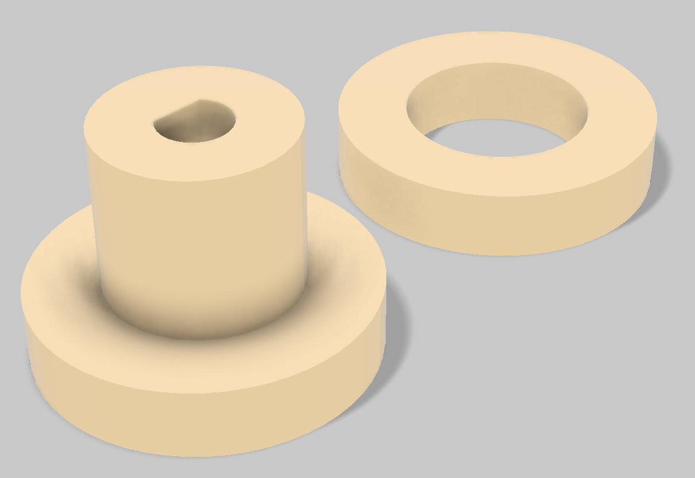

# A Modular Kit for Machine Art Drawing
## An Hypocycloid drawing machine controled by a BBC micro:bit

## BOM
To make this project you nedd at least the following parts:

- [BBC micro:bit](https://www.kitronik.co.uk/5614-bbc-microbit-board-only-retail-pack.html)
- Kitronik [All-in-one robotic board](https://www.kitronik.co.uk/5641-all-in-one-robotics-board-for-bbc-microbit.html)
- Two (or more) [metal geared micro](https://www.kitronik.co.uk/2586-n20-series-micro-metal-gearmotor-2981.html) motors by Kitronik

## JS Source
The source file for the BBC micro:bit is the Javascript version of the makecode it was originally written. To run this project you should import the Kitronik all-in-one robotic board library from the makecode on the micro:bit site [here](https://makecode.microbit.org/#).

### How to proceed
Open the *[makecode site](https://makecode.microbit.org/#)* and create a new project.

First of all import from the extensions the Kitronik all-in-one robotic library. 

Select Java in the editor page then copy and paste the Javascript source from the repository.

*The same program can work as well without the board and in this case no library should be imported, but some changes to the motor control functions should be added.*

If you only past the source *as-is* in the editor then you can revert it to the block view and the program will work as well. If you edit the Javascript the blocks view maybe no longer work properly. If you have knowledge of programming you can ignore the graphic view at all and proceed editing the source.

## Drawing and Rendering Stuff
The folders **[STL](STL)** and **[SVG](SVG)** contain the files needed for 3D print and laser-cut the moving parts. As well, if you plan to use a different motor for the wheels, the motor support should be redesigned. The laser-cut parts can also be printed on carboard and cut bu hand.

### 3D Rendering
Below the 3D model rendering of the 3D printed parts. The design has been created with Fusion360 and the rendered images are in the *[rendering](rendering)* folder.

 

 

 

